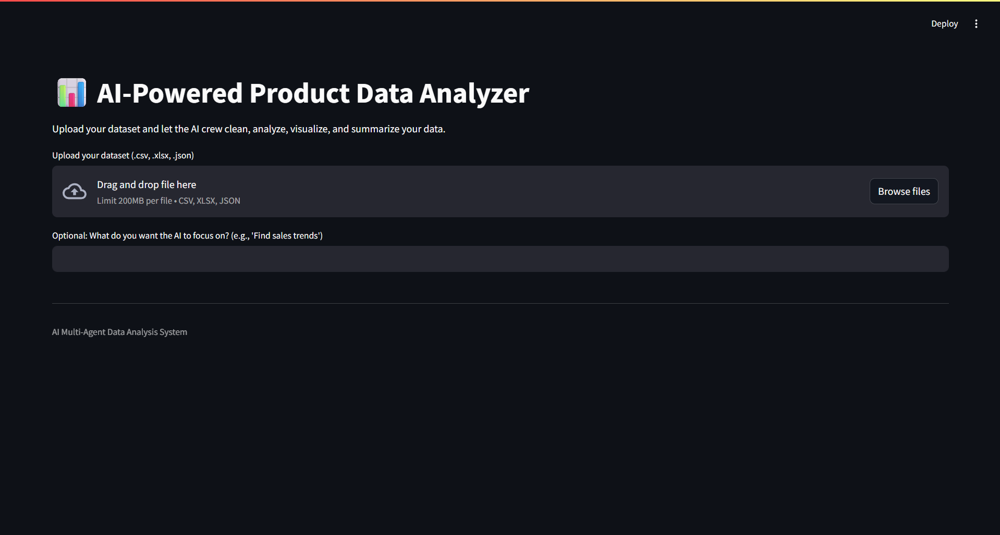
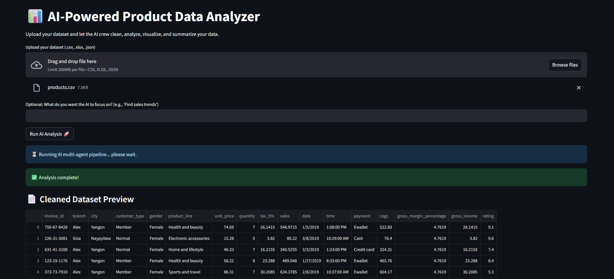
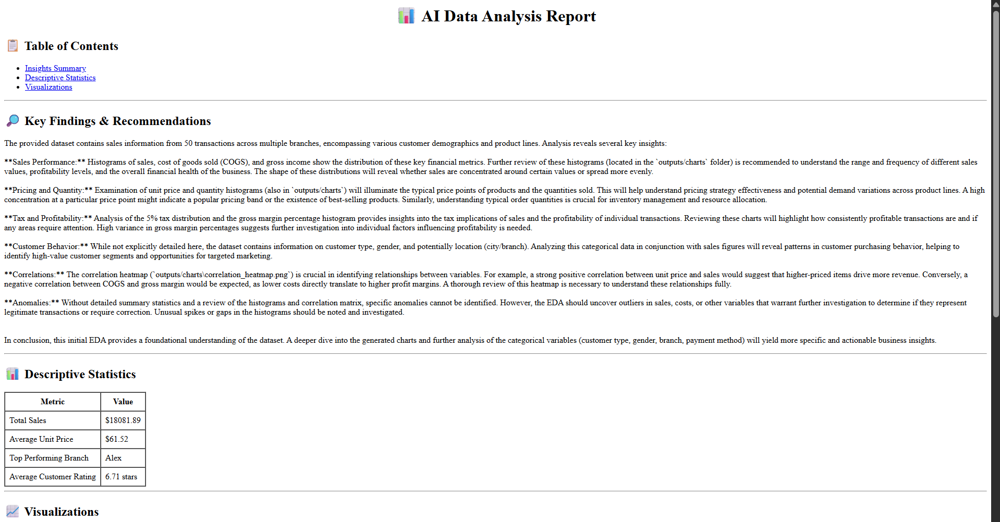

 
# AI-Powered Product Data Analyzer

A modular, multi-agent system designed for analyzing product datasets using LangChain, LangGraph, and Gemini API. This platform helps users explore, visualize, and summarize their data with clean, business-friendly insights.

##  Overview

This system lets users upload a dataset (CSV, Excel, JSON), specify a business focus (e.g., "Find sales trends"), and receive a detailed AI-generated data analysis report in clear, non-technical language.

🔎 Behind the scenes, a crew of specialized AI agents performs:
- Automated data cleaning
- Exploratory Data Analysis (EDA)
- Insight detection (trends, anomalies, correlations)
- Visualization generation
- Professional summary writing

All packaged in a smooth, user-friendly web interface.

---

## User Interface

The UI provides a seamless experience:
1. **Upload your dataset** – supports `.csv`, `.xlsx`, `.json` (limit 200MB).
2. **(Optional)** Enter a focus prompt for the AI (e.g., "Analyze customer satisfaction").
3. **Run AI Analysis** – behind the scenes, a LangGraph-powered multi-agent workflow cleans, analyzes, and visualizes your data.
4. **View Results**:
   - Cleaned dataset preview
   - Generated visualizations (charts, heatmaps)
   - Executive summary
   - Option to **download full report as PDF**




---

## Prompt-Driven Agents

A core agent prompt drives natural language insight generation:

> "You are a data analyst assistant.  
> The user has uploaded a dataset. Based on the following exploratory data analysis (EDA) results and charts, write a professional summary highlighting key insights, patterns, trends, correlations, and any anomalies.  
> Write the insights in clear, non-technical business language."

---

## Project Structure

``` bash 
.
├── .langgraph_api/ # LangGraph config
├── agents/ # Specialized agent logic
├── configs/ # App and pipeline settings
├── data/ # Uploaded or temporary datasets
├── outputs/ # Generated reports & visualizations
├── services/ # Utility services (EDA, charting, etc.)
├── ui/ # Frontend interface (e.g., Gradio/Streamlit)
├── workflows/ # LangGraph pipeline definitions
├── run.py # App entrypoint
├── requirements.txt # Python dependencies
├── README.md # Project documentation
├── langgraph.json # LangGraph workflow configuration
└── .env # API keys and environment settings
```


---
## Example Outputs

- ✅ Cleaned dataset preview
- 📈 Histograms, bar charts, correlation heatmaps
- 📃 Insightful PDF report with:
  - Key Findings
  - Descriptive Stats
  - Visualizations




---

## Technologies Used

- **LangChain** + **LangGraph** for multi-agent orchestration
- **Gemini API** for natural language insight generation
- **Pandas / Seaborn / Matplotlib** for EDA and visualization
- **Gradio / Streamlit** (or similar) for frontend interface
- **WeasyPrint / HTML2PDF** for report generation

---

## Installation
```bash
git clone https://github.com/your-repo/product-data-analyzer.git
cd product-data-analyzer
python -m venv venv
source venv/bin/activate
pip install -r requirements.txt

```

## Configuration
1. **API Keys**: Set up your API keys in the `.env` file.
2. **LangGraph**: Configure your LangGraph settings in `.langgraph_api/`.
3. **Run the app**: Start the web interface with:


## Contributors

- **El Hachymi Ahmed Yassine**

- **BOURI Souhail**

- **AJI Othman**

**Supervised by:**  *Mme. Bentaleb Asmae*